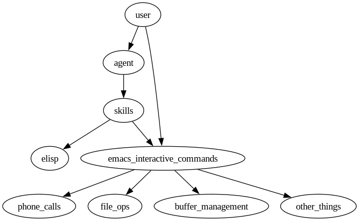

#+title: EmacsOS

EmacsOS is a malleable, agent-customizable, local-first operating system built on Emacs, for small touchscreen devices. The phone is the user's most personal device, and they should be able to do anything they need to on it. The principles guiding this project include:
- Malleable - Emacs is the substrate, so every keybinding, buffer behavior, and display rule is just elisp that can be changed at runtime. See [[https://malleable.systems/][malleable.systems]].
- Agent-customizable - Editing elisp on a 320x240 screen with a T9 keyboard is miserable, so an agent does it instead, driven by natural language like "set up gnus for my gmail", with single-tap roll-back to any prior version. Design: [[file:docs/2026-05-12-agent-driven-customization.org][docs/2026-05-12-agent-driven-customization.org]].
- Local-first - The user's data, configuration history, and decisions stay on machines they own. No mandatory cloud, no remote service the phone depends on to keep working.

* Quick Start

#+begin_src sh
make start
#+end_src

This launches Emacs in a 320x240 pixel window with no user configuration loaded — only =os.el=.

* Features

** Virtual Keyboard

A virtual keyboard is displayed in a dedicated window at the bottom of the frame. The layout follows the *Optimal-T9* design from [[https://doi.org/10.1145/3279778.3279786][Qin et al., ISS 2018]], a 3x3 multi-letter key layout optimized for clarity, speed, and learnability on small touchscreens.

#+begin_example
[ qw ] [ertyui] [ op ]
[ as ] [ dfgh ] [jkl ]
[ zxc] [ vbn  ] [ m  ]
[  SPC   ] [RET] [DEL]
[ caps]
#+end_example

- *Multi-tap input*: tap a key to type its first letter, tap again quickly to cycle through the remaining letters on that key. After a 1-second pause, the current letter is committed.
- The keyboard is non-editable and does not steal focus — typed characters are inserted into the editing buffer in the top window.
- *CAPS* toggles uppercase input.

* Remote Development

EmacsOS can be controlled from another device over the network — useful for testing on a phone with no physical keyboard.

** On the phone (target device)

Start EmacsOS with the server enabled:

#+begin_src sh
make start-server
#+end_src

This launches EmacsOS and starts the Emacs server listening on all interfaces (TCP). An auth file is written to =~/.emacs.d/server/server= containing the port and authentication key.

** Sending eval expressions (TCP, no SSH)

Copy the auth file from the phone and fix the address:

#+begin_src sh
scp phone:~/.emacs.d/server/server ./server-file
sed -i 's/0\.0\.0\.0/192.168.1.42/' ./server-file   # use the phone's actual IP
#+end_src

Then evaluate expressions directly from your dev machine:

#+begin_src sh
emacsclient -f ./server-file -e '(buffer-name)'
#+end_src

** Opening a full terminal frame (SSH)

=emacsclient -t= requires the server to access the client's TTY device, which doesn't work across machines over TCP. Use SSH instead — =emacsclient= runs on the phone and the terminal renders over the SSH connection:

#+begin_src sh
ssh -t phone emacsclient -t
#+end_src

This gives you a full Emacs frame in your terminal, sharing all buffers and state with the phone's EmacsOS session.

** Examples

*** Typing via the virtual keyboard

The =emacos--tap-key= function handles multi-tap and inserts into the correct buffer:

#+begin_src sh
emacsclient -f ./server-file -e '(emacos--tap-key "qw")'    # types "q"
emacsclient -f ./server-file -e '(emacos--tap-key "qw")'    # cycles to "w"
emacsclient -f ./server-file -e '(emacos--tap-space)'        # space
emacsclient -f ./server-file -e '(emacos--tap-return)'       # newline
emacsclient -f ./server-file -e '(emacos--tap-backspace)'    # delete backward
#+end_src

*** Direct buffer manipulation

#+begin_src sh
emacsclient -f ./server-file -e '(with-selected-window (emacos--target) (insert "Hello from remote!"))'
emacsclient -f ./server-file -e '(with-selected-window (emacos--target) (erase-buffer))'
#+end_src

*** Running commands

#+begin_src sh
emacsclient -f ./server-file -e '(emacos--run-command #'\''find-file)'   # run a command in the editor
emacsclient -f ./server-file -e '(emacos--chat-show-top-buffer)'          # switch the editor to the chat app
#+end_src

* Chat Server

=emacsos-server= (in =server/=) is a small FastAPI process that handles
=POST /chat= from the phone's CHAT page.  Each request opens a
*streaming* response (NDJSON over chunked HTTP): tokens arrive
incrementally as the agent produces them; =chat.el= renders them
in place, never blocking the phone's main loop.  The user can tap
ABORT on the CHAT page at any point during a stream.

** Running

=ASSIST_MODEL_URL= must point at an OpenAI-compatible chat
endpoint, and it must be present in the server *process's*
environment.  If it's missing the server still starts, but every
=/chat= fails the instant it builds the agent (=RuntimeError:
ASSIST_MODEL_URL is required=) — which the phone surfaces as
="error: connection closed"=.  Set it on the launch command:

#+begin_src sh
ASSIST_MODEL_URL=http://localhost:8000/v1 make server
#+end_src

The model URL (and the deploy vars) usually live in the sibling
=assist= checkout's =.dev.env=.  Source that so you don't have to
remember the value:

#+begin_src sh
set -a; . ../assist/.dev.env; set +a   # exports ASSIST_MODEL_URL &c.
make server
#+end_src

=make server= runs uvicorn with =--reload= (auto-restarts on file
edits), which is convenient while developing.  For a *stable single
worker* — e.g. when tailing the log to catch a crash, where
=--reload='s respawns would muddy it — launch uvicorn directly:

#+begin_src sh
set -a; . ../assist/.dev.env; set +a
cd server && .venv/bin/python -m uvicorn emacsos_server.app:app \
  --host 0.0.0.0 --port 8765
#+end_src

To restart, stop the running worker and let the port free before
relaunching (a second uvicorn on =:8765= dies with "address already
in use"):

#+begin_src sh
pkill -f 'uvicorn emacsos_server.app:app'
#+end_src

Each =/chat= invokes =assist.Thread.stream_message()= and pipes
its events (=start=, =token=, =status=, =heartbeat=, =end=,
=error=) into an NDJSON stream.  Long research-shaped questions
that the previous sync design's 270s timeout couldn't accommodate
now run as long as the user lets them — they show status updates
(e.g. ="calling task"=) until the agent emits content tokens,
then the bot reply streams into =*chat*= word by word.

User-tunable from =chat.el=:
- =emacos-chat-first-token-timeout= (default 30s) — declares
  "no response from server" if no event lands within this window.
  Replaces the old sync total-call timeout.
- =emacos-chat-server-url= — usually baked in by =make phone-install=.

** Bumping assist

emacsos-server depends on a sibling =assist= checkout.  The Makefile
installs assist editably from =$(ASSIST_REPO_DIR)= (default =../assist=
relative to the emacsos repo).  To take a newer assist:

#+begin_src sh
cd /path/to/assist && git pull
cd /path/to/emacsos && rm -rf server/.venv && make setup-server
#+end_src

Or override the path: =make setup-server ASSIST_REPO_DIR=/abs/path/to/assist=.

** Smoke

=make smoke= spins a dockerized phone simulation, starts the
server, and exercises both the curl path (server in isolation) and
the =chat.el= path (full client surface) against a real LLM
endpoint.  Requires =ASSIST_MODEL_URL= to be set in the calling
shell:

#+begin_src sh
ASSIST_MODEL_URL=http://localhost:8000/v1 make smoke
#+end_src

* Project Structure

- =os.el= — main init file (keyboard, frame setup)
- =chat.el= — CHAT page, =*chat*= transcript, SEND wiring to =/chat=
- =server/= — emacsos-server (FastAPI + phone driver)
- =docs/= — design docs for in-progress and planned features
- =deploy/= — install artifacts (init snippet template)
- =references/= — research papers informing the keyboard design
- =Makefile= — launch + deploy + test + smoke targets

* Layers
Control of the system should be funneled mainly through emacs. This allows the user and agent to access the same functionality. The agent and user should be acting through emacs: either elisp or direct, interactive commands. See below:

#+begin_src dot :file images/layers.png
digraph G {
    user -> agent;
    agent -> skills;
    skills -> emacs_interactive_commands;
    skills -> elisp;
    user -> emacs_interactive_commands;
    emacs_interactive_commands -> phone_calls;
    emacs_interactive_commands -> file_ops;
    emacs_interactive_commands -> buffer_management;
    emacs_interactive_commands -> other_things;
}
#+end_src

#+RESULTS:

** The principle: deterministic primitives + an interpretive agent

Everything the device *does* is an emacs command, and the line between the two
actors is *determinism*:

- *Emacs interactive commands are deterministic primitives.* A concrete
  argument in, the same action out — every time, with no language model in the
  loop and no callback into the agent. =(emacos-call "+14155550123")= dials that
  number. It does not ask "who is that?", it does not confirm, it does not think.
  These primitives are the reliable floor that the user (by tapping) and the
  agent (by evaluating elisp) share equally.

- *The agent is the interpretive layer on top.* Turning fuzzy human intent
  ("call Pierre") into a concrete primitive call is irreducibly the agent's job:
  who is Pierre, what does "call" mean, what is his number, is there more than
  one match? Resolution, disambiguation, and confirmation live *here* — never
  inside a primitive.

- *Skills are elisp recipes.* A skill does not add a bespoke tool; it tells the
  agent which elisp to evaluate — to either *initiate* a deterministic command
  (=(emacos-call "+1…")=) or *change/extend* functionality (define a command,
  then persist it via the config layer). The agent's one universal lever is
  evaluating elisp.

So a feature is built as: a deterministic emacs command (shared by user and
agent) + a skill that teaches the agent how to resolve intent down to that
command's concrete arguments. "call Pierre" is agent work; =(emacos-call
"+1…")= is a primitive. They must not blur together.

(Agent-platform services that are *not* device control — the language model,
conversation memory, config git-versioning/rollback — stay server-side; the
deterministic-primitive rule is about controlling the *device*.)
