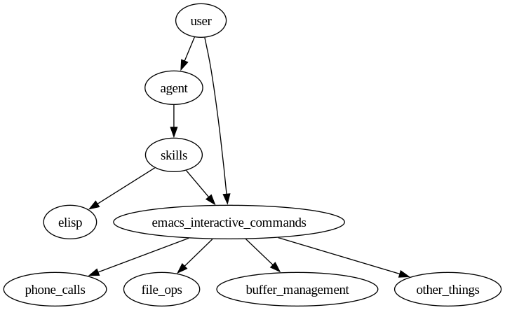

#+title: EmacsOS

EmacsOS is a malleable, agent-customizable, local-first operating system built on Emacs, for small touchscreen devices. The phone is the user's most personal device, and they should be able to do anything they need to on it. The principles guiding this project include:
- Malleable - Emacs is the substrate, so every keybinding, buffer behavior, and display rule is just elisp that can be changed at runtime. See [[https://malleable.systems/][malleable.systems]].
- Agent-customizable - Editing elisp on a 320x240 screen with a T9 keyboard is miserable, so an agent does it instead, driven by natural language like "set up gnus for my gmail", with single-tap roll-back to any prior version. Design: [[file:docs/2026-05-12-agent-driven-customization.org][docs/2026-05-12-agent-driven-customization.org]].
- Local-first - The user's data, configuration history, and decisions stay on machines they own. No mandatory cloud, no remote service the phone depends on to keep working.

* Quick Start

#+begin_src sh
make start
#+end_src

This launches Emacs in a 320x240 pixel window with no user configuration loaded — only =os.el=.

It runs as a *separate Emacs process* (=emacs -Q= skips your =init.el=, site-lisp, and startup screen), so it is a self-contained simulator you can run on your dev machine — including as a window alongside another Emacs session, e.g. under an EXWM desktop — without touching your own configuration. Do *not* =load-file os.el= into your everyday Emacs as a shortcut: =os.el= rebinds keys, registers hooks, and resizes the frame, so it must run in its own =emacs -Q= process to stay isolated.

The chat panel POSTs to =emacsos-chat-server-url= (default =http://localhost:8765/chat=). For pure UI/layout work no server is needed; to make the simulator actually reach an agent, run a [[*Chat Server][Chat Server]] and point that variable at it.

* Features

** Virtual Keyboard

A virtual keyboard is displayed in a dedicated window at the bottom of the frame. The layout follows the *Optimal-T9* design from [[https://doi.org/10.1145/3279778.3279786][Qin et al., ISS 2018]], a 3x3 multi-letter key layout optimized for clarity, speed, and learnability on small touchscreens.

#+begin_example
[ qw ] [ertyui] [ op ]
[ as ] [ dfgh ] [jkl ]
[ zxc] [ vbn  ] [ m  ]
[  SPC   ] [RET] [DEL]
[ caps]
#+end_example

- *Multi-tap input*: tap a key to type its first letter, tap again quickly to cycle through the remaining letters on that key. After a 1-second pause, the current letter is committed.
- The keyboard is non-editable and does not steal focus — typed characters are inserted into the editing buffer in the top window.
- *CAPS* toggles uppercase input.

* Remote Development

EmacsOS can be controlled from another device over the network — useful for testing on a phone with no physical keyboard.

** On the phone (target device)

Start EmacsOS with the server enabled:

#+begin_src sh
make start-server
#+end_src

This launches EmacsOS and starts the Emacs server listening on all interfaces (TCP). An auth file is written to =~/.emacs.d/server/server= containing the port and authentication key.

The same command works for a *local simulator*, not just the phone — run =make start-server= on your dev machine and you can drive the simulator's buffers from your everyday Emacs exactly as below. The auth file is already local (no =scp= needed); it still records =0.0.0.0=, so rewrite that to =127.0.0.1= if your =emacsclient= won't connect to =0.0.0.0=.

** Sending eval expressions (TCP, no SSH)

Copy the auth file from the phone and fix the address:

#+begin_src sh
scp phone:~/.emacs.d/server/server ./server-file
sed -i 's/0\.0\.0\.0/192.168.1.42/' ./server-file   # use the phone's actual IP
#+end_src

Then evaluate expressions directly from your dev machine:

#+begin_src sh
emacsclient -f ./server-file -e '(buffer-name)'
#+end_src

** Opening a full terminal frame (SSH)

=emacsclient -t= requires the server to access the client's TTY device, which doesn't work across machines over TCP. Use SSH instead — =emacsclient= runs on the phone and the terminal renders over the SSH connection:

#+begin_src sh
ssh -t phone emacsclient -t
#+end_src

This gives you a full Emacs frame in your terminal, sharing all buffers and state with the phone's EmacsOS session.

** Examples

*** Typing via the virtual keyboard

The =emacsos--tap-key= function handles multi-tap and inserts into the correct buffer:

#+begin_src sh
emacsclient -f ./server-file -e '(emacsos--tap-key "qw")'    # types "q"
emacsclient -f ./server-file -e '(emacsos--tap-key "qw")'    # cycles to "w"
emacsclient -f ./server-file -e '(emacsos--tap-space)'        # space
emacsclient -f ./server-file -e '(emacsos--tap-return)'       # exit minibuffer; otherwise run the target buffer's RET command
emacsclient -f ./server-file -e '(emacsos--tap-backspace)'    # delete backward
#+end_src

*** Direct buffer manipulation

#+begin_src sh
emacsclient -f ./server-file -e '(with-selected-window (emacsos--target) (insert "Hello from remote!"))'
emacsclient -f ./server-file -e '(with-selected-window (emacsos--target) (erase-buffer))'
#+end_src

*** Running commands

#+begin_src sh
emacsclient -f ./server-file -e '(emacsos--run-command #'\''find-file)'   # run a command in the editor
emacsclient -f ./server-file -e '(emacsos--chat-show-top-buffer)'          # switch the editor to the chat app
#+end_src

*** Driving the =*chat*= buffer

The chat transcript lives in the =*chat*= buffer (the [[*Layers][universal launchpad]]). Read or steer it remotely:

#+begin_src sh
emacsclient -f ./server-file -e '(with-current-buffer "*chat*" (buffer-string))'   # read the transcript
emacsclient -f ./server-file -e '(emacsos--chat-show-top-buffer)'                    # bring chat to the editor window
#+end_src

For an *interactive* session in =*chat*= — scrolling, typing, watching a stream — open a terminal frame over SSH (above) and =C-x b *chat*=. The buffer stays in the phone's (or simulator's) Emacs; you are driving the real session remotely, not a copy. A live buffer can't be moved into a *different* Emacs process; the =-e= calls above are snapshots/commands, and the SSH frame is the way to operate it by hand.

* Chat Server

=emacsos-server= (in =server/=) is a small FastAPI process that handles
=POST /chat= from the phone's CHAT page.  Each request opens a
*streaming* response (NDJSON over chunked HTTP): tokens arrive
incrementally as the agent produces them; =chat.el= renders them
in place, never blocking the phone's main loop.  The user can tap
ABORT on the CHAT page at any point during a stream.

** Running

=ASSIST_MODEL_URL= must point at an OpenAI-compatible chat
endpoint, and it must be present in the server *process's*
environment.  If it's missing the server still starts, but every
=/chat= fails the instant it builds the agent (=RuntimeError:
ASSIST_MODEL_URL is required=) — which the phone surfaces as
="error: connection closed"=.  Set it on the launch command:

#+begin_src sh
ASSIST_MODEL_URL=http://localhost:8000/v1 make server
#+end_src

The model URL (and the deploy vars) usually live in the sibling
=assist= checkout's =.dev.env=.  Source that so you don't have to
remember the value:

#+begin_src sh
set -a; . ../assist/.dev.env; set +a   # exports ASSIST_MODEL_URL &c.
make server
#+end_src

=make server= runs uvicorn with =--reload= (auto-restarts on file
edits), which is convenient while developing.  For a *stable single
worker* — e.g. when tailing the log to catch a crash, where
=--reload='s respawns would muddy it — launch uvicorn directly:

#+begin_src sh
set -a; . ../assist/.dev.env; set +a
cd server && .venv/bin/python -m uvicorn emacsos_server.app:app \
  --host 0.0.0.0 --port 8765
#+end_src

To restart, stop the running worker and let the port free before
relaunching (a second uvicorn on =:8765= dies with "address already
in use"):

#+begin_src sh
pkill -f 'uvicorn emacsos_server.app:app'
#+end_src

Each =/chat= invokes =assist.Thread.stream_message()= and pipes
its events (=start=, =token=, =status=, =heartbeat=, =end=,
=error=) into an NDJSON stream.  Long research-shaped questions
that the previous sync design's 270s timeout couldn't accommodate
now run as long as the user lets them — they show status updates
(e.g. ="calling task"=) until the agent emits content tokens,
then the bot reply streams into =*chat*= word by word.

User-tunable from =chat.el=:
- =emacsos-chat-first-token-timeout= (default 30s) — declares
  "no response from server" if no event lands within this window.
  Replaces the old sync total-call timeout.
- =emacsos-chat-server-url= — usually baked in by =make phone-install=.

** Bumping assist

emacsos-server depends on a sibling =assist= checkout.  The Makefile
installs assist editably from =$(ASSIST_REPO_DIR)= (default =../assist=
relative to the emacsos repo).  To take a newer assist:

#+begin_src sh
cd /path/to/assist && git pull
cd /path/to/emacsos && rm -rf server/.venv && make setup-server
#+end_src

Or override the path: =make setup-server ASSIST_REPO_DIR=/abs/path/to/assist=.

** Smoke

=make smoke= spins a dockerized phone simulation, starts the
server, and exercises both the curl path (server in isolation) and
the =chat.el= path (full client surface) against a real LLM
endpoint.  Requires =ASSIST_MODEL_URL= to be set in the calling
shell:

#+begin_src sh
ASSIST_MODEL_URL=http://localhost:8000/v1 make smoke
#+end_src

* Desktop Assist only

=assist-desktop.el= loads the existing Assist Web client into ordinary Emacs.
It does not load the phone OS, modem, keyboard, theme or server startup.
Use Emacs 29 or newer with GnuTLS and native JSON support, Python 3.10+,
Git, Make, OpenSSH and GNU coreutils.  Install Magit in your normal Emacs with
=M-x package-install RET magit RET= for =C-c d= diffs.  No Python server or
local model is needed on the laptop.

On macOS with Homebrew:

#+begin_src sh
xcode-select --install
brew install --cask emacs-app
brew install python coreutils
#+end_src

The Command Line Tools supply Git and Make; skip their installation if already
present.  Coreutils supplies =gtimeout=.  In graphical Emacs, make Homebrew's
=bin= directory visible in =exec-path= before loading the client: use
=(add-to-list 'exec-path "/opt/homebrew/bin")= on Apple Silicon, or
=(add-to-list 'exec-path "/usr/local/bin")= on Intel.  The Git client resolves
Python and =timeout= or =gtimeout= through that path.  For batch checks, expose
Emacs.app's =Contents/MacOS/= directory in your shell's =PATH= if =emacs= is
not already available.

On Linux, install your system's Emacs, Python, Git, Make, OpenSSH and coreutils
packages; the timeout executable is normally named =timeout=.

On the laptop, clone this feature branch while PR #57 is awaiting merge:

#+begin_src sh
mkdir -p ~/src
cd ~/src
git clone --branch emacsos-desktop-assist https://github.com/pierrel/emacsos.git
cd emacsos
make install-desktop
#+end_src

=make install-desktop= installs only the five Assist client files to
=~/.local/share/emacsos-assist/=.  It preserves unrelated files and refuses
an update if an installed client file was edited locally.  Installation also
refuses adjacent client =.elc= files, which Emacs can load ahead of updated source.
Move the named compiled file outside the installation directory before retrying;
refusal leaves both source and bytecode untouched.  To select another location, use =make install-desktop DESKTOP_ASSIST_DIR="/your/path"= and adjust
the loader path below.  You can also load =assist-desktop.el= directly from the
checkout.

Before connecting, make the Assist server reachable from the laptop through
your trusted LAN or VPN/WireGuard connection.  Use its HTTPS URL, with
=/api/v1/phone= appended; the hostname or address must match its certificate.
Provision your token and, if needed, its trusted public CA certificate through
your existing private setup.  Keep those files separate from the clone and
installed code.  Create =~/.config/emacsos/= privately (=chmod 700=), and
make the token and private Git files below mode =0600=.

In your private Emacs init, set the endpoint, credential and any custom cache
paths before loading the client (the endpoint below is a placeholder):

#+begin_src emacs-lisp
(setq emacsos-assist-web-api-url "https://assist.example/api/v1/phone"
      emacsos-assist-web-token-file "~/.config/emacsos/assist-web-token"
      emacsos-assist-web-ca-file "~/.config/emacsos/assist-web-ca.pem")
(load "~/.local/share/emacsos-assist/assist-desktop.el" nil t)
#+end_src

The token file must be a regular user-owned file with mode =0600= containing
one bearer token.  Keep credentials out of the init and repository.  The optional
CA file holds one PEM X.509 certificate; use =nil= for system trust.  The client
requires HTTPS and verifies TLS.  Copy/provision these private files through your
existing trusted credential setup, independently of the code installation.

Git uses separate private, regular, user-owned =0600= files in
=~/.config/emacsos/=: =assist-git-remotes.json= maps the catalog's 20-character
=repo_key= to a credential-free =ssh://user@host/path/repository.git= URL;
=assist-git-key= is the SSH private key; =assist-git-known-hosts= contains verified
host pins.  The helper ignores global Git/SSH config and uses noninteractive,
strict host checking, so configure these files even if ordinary =git clone=
works.  The helper does not pass through your SSH agent and cannot prompt for a
key passphrase; use a dedicated noninteractive key with the required repository
access.  A mapping example (replace both fields using the actual catalog/source):

#+begin_src json
{"0123456789abcdef0123": "ssh://git@git.example/project.git"}
#+end_src

Check private Git file structure without contacting the remote:
=python3 ~/.local/share/emacsos-assist/assist-web-git-helper.py --check-config=.
An =ok=true= result checks configuration, not connectivity or key permissions
on the Git server.  Thread chat works without Git configuration; file/diff
actions report an unavailable workspace until Git setup and fetching succeed.

Run =M-x emacsos-desktop-assist=.  The list uses =g= to refresh, =C-c a n= to
start a new thread, and =RET= or mouse-1 to open a thread.  The new-thread key is
local to the thread list.  =M-x emacsos-assist-web-open-thread= offers filtered
completion; =M-x emacsos-assist-web-new-thread= selects a repository and harness
and opens a local draft.  Type after the final => = prompt in a thread/draft;
=RET= inserts a newline and =C-RET= sends.  =C-c C-r= refreshes the thread,
=C-c C-l= loads older messages, and =C-c C-k= aborts/detaches with the client's
existing canonical outcome checks.  Loading the file alone makes no request;
the entry command refreshes the catalog.

In a canonical thread, =C-x C-f= opens the existing local editable Git workspace
without fetching, =C-c g= explicitly refreshes Git, and =C-c d= compares local
=HEAD= against cached =origin/main= in Magit.  Use Magit's ordinary status/diff
commands to inspect uncommitted edits.  =C-c ?= shows thread details and workspace
location; file/diff views offer =C-c b= to return to the thread.  Git keys become
available after a new draft has a canonical thread ID.

New files live under =~/assist/<repo>/<thread>-<stable-id>/=.  Existing legacy
workspaces remain in place.  Private Git metadata and workspace bindings live
in =~/.cache/emacsos/assist-git/=; catalogs, snapshots and durable drafts live
in =~/.cache/emacsos/assist-web/=.  Customize
=emacsos-assist-web-git-workspace-directory=,
=emacsos-assist-web-git-cache-directory= and =emacsos-assist-web-cache-directory=
before loading the client if needed: loading reads the selected catalog cache
immediately.  Preserve these settings for existing workspaces:
their saved routes bind each thread to a stable directory.  Local edits,
untracked files, commits and unsaved visiting buffers are preserved; refresh
reports pending changes rather than resetting, stashing or force pushing.

After PR #57 is merged, switch this clone to the release branch once:

#+begin_src sh
cd ~/src/emacsos
git fetch origin
git switch main
git branch --set-upstream-to=origin/main main
#+end_src

Then update the installed code from that same checkout:

#+begin_src sh
cd ~/src/emacsos
git pull --ff-only
make install-desktop
#+end_src

Use the same =DESKTOP_ASSIST_DIR= override if you chose a custom destination.
Restart Emacs after an update so all client files load together.  Installation
and updates do not edit your init, private configuration, credentials, caches
or thread workspaces.  If an installed file was changed locally, keep that
work and reconcile it before retrying.  During an update, replaced client files
are retained in a =.assist-desktop-update-*= directory, including edits saved
concurrently with installation.  Its path is printed on success; after an
interruption, find it under the installation directory.  Keep that recovery directory until you
have checked the update; removing it later is your choice.

To launch without changing your init, put the private =setq= configuration
above in =~/.config/emacsos/assist-desktop-config.el= (mode =0600=) and run:

#+begin_src sh
emacs -Q --load ~/.config/emacsos/assist-desktop-config.el \
  --load ~/.local/share/emacsos-assist/assist-desktop.el \
  --funcall emacsos-desktop-assist
#+end_src

=-Q= skips installed package initialization, including Magit.  Use your ordinary
Emacs with the init snippet for diffs.  =make test-desktop-assist= exercises
clean installation, repeated updates, preservation of local/private work,
the standalone loader, relevant client ERT tests and local Git-helper tests
without production model/GPU use.  The Linux installation and Git checks pass;
macOS API bindings are checked with mocks, with no native macOS run yet.  On the
laptop, run =make test-desktop-assist=, then open the thread list, open a real
thread and use =C-c g=, =C-x C-f= and =C-c d= to check Git connectivity and Magit.
A connected send is a separate live check.  Package references: [[https://formulae.brew.sh/cask/emacs-app][Emacs for macOS]] and
[[https://elpa.nongnu.org/nongnu/magit.html][Magit]] and [[https://formulae.brew.sh/formula/coreutils][GNU coreutils]].

* Canonical Assist Web threads

Assist Web thread buffers use the authenticated HTTPS phone API and SSE only as
a provisional observation: the final canonical Assist snapshot remains truth.
=C-c a l= opens a native, touch-sized thread list, while =C-c a t= opens the
filtered catalog completion chooser when threads exist and otherwise falls back
to that list.  The list renders the validated local catalog immediately,
refreshes it asynchronously, and exposes visible refresh or retry rows.  Each
two-line row opens its exact thread with mouse-1 or RET.  Both entry points
share the same complete thread, repository, and harness catalog.
Top-level text streams in 7 KiB UTF-8 server chunks; the phone accepts 16 KiB
deltas and 64 KiB events, while Assist caps encoded SSE records at 48 KiB, each
send at five seconds, and an observation at 30 minutes plus one five-second
final-send grace period.  A reserved ordinary
busy follower or initializing run returns =live_text=true=, but its SSE is a
delta-empty status observation until the eventual worker starts.  Pi and
journal saturation return =live_text=false=; an older Assist server visibly
falls back to status-only observation.  ABORT before POST acceptance leaves an
acceptance-unknown committed turn; Send reuses its exact idempotency key to
re-observe it.  Afterwards, only HTTP 200 =cancelled= confirms cancellation;
structured HTTP 409 =running= or =transitioning= truthfully detaches, and other
terminal outcomes reconcile the canonical snapshot.  =awaiting_approval= is a
nonterminal Run state, but it ends this finite live-text observation and also
reconciles the canonical snapshot so the approval state becomes visible.
If Assist confirms that the thread was deleted while an observer is open, the
client retains visible partial text and the next draft, clears the accepted
retry identity, and starts the next submission as a new thread.  If the durable
Run store becomes unavailable, it instead preserves that identity and reports
that an operator must repair observation; it never retries automatically.  The
current closure corrections are [[file:docs/2026-09-09-conversation-observation-closure-amendment.org][the observation closure amendment]],
[[file:docs/2026-09-09-conversation-deletion-closure-amendment.org][the deleted-thread closure amendment]],
and [[file:docs/2026-09-09-conversation-stream-batching-amendment.org][the stream-batching amendment]].

* Project Structure

- =os.el= — main init file (keyboard, frame setup)
- =chat.el= — CHAT page, =*chat*= transcript, SEND wiring to =/chat=
- =phone-sms.el= / =phone-sms-chat.el= — confirmed SMS transport and bounded native conversations
- =server/= — emacsos-server (FastAPI + phone driver)
- =docs/= — design docs for in-progress and planned features
- =deploy/= — install artifacts (init snippet template)
- =references/= — research papers informing the keyboard design
- =Makefile= — launch + deploy + test + smoke targets

* Layers
Control of the system should be funneled mainly through emacs. This allows the user and agent to access the same functionality. The agent and user should be acting through emacs: either elisp or direct, interactive commands. See below:

#+begin_src dot :file images/layers.png
digraph G {
    user -> agent;
    agent -> skills;
    skills -> emacs_interactive_commands;
    skills -> elisp;
    user -> emacs_interactive_commands;
    emacs_interactive_commands -> phone_calls;
    emacs_interactive_commands -> file_ops;
    emacs_interactive_commands -> buffer_management;
    emacs_interactive_commands -> other_things;
}
#+end_src

#+RESULTS:

** The principle: deterministic primitives + an interpretive agent

Everything the device *does* is an emacs command, and the line between the two
actors is *determinism*:

- *Emacs interactive commands are deterministic primitives.* A concrete
  argument in, the same action out — every time, with no language model in the
  loop and no callback into the agent. =(emacsos-call "+14155550123")= stages
  that exact number in the local call UI. It does not ask "who is that?" or
  think. These primitives are the reliable floor that the user (by tapping)
  and the agent (by evaluating elisp) share.

- *The agent is the interpretive layer on top.* Turning fuzzy human intent
  ("call Ana") into a concrete primitive call is irreducibly the agent's job:
  who is Ana, what does "call" mean, what is her number, is there more than
  one match? Resolution and disambiguation live here. Authorization for a
  safety-critical side effect can remain a deterministic local UI boundary:
  in the ordinary public flow, two phone actions are required after staging.

- *Skills are elisp recipes.* A skill does not add a bespoke tool; it tells the
  agent which elisp to evaluate — to either *initiate* a deterministic command
  (=(emacsos-call "+1…")= stages a proposal) or *change/extend* functionality (define a command,
  then persist it via the config layer). The agent's one universal lever is
  evaluating elisp.

So a feature is built as: a deterministic emacs command (shared by user and
agent) + a skill that teaches the agent how to resolve intent down to that
command's concrete arguments. "call Ana" is agent work; =(emacsos-call
"+1…")= is a proposal primitive; two local confirmations own the modem effect.
They must not blur together.

(Agent-platform services that are *not* device control — the language model,
conversation memory, config git-versioning/rollback — stay server-side; the
deterministic-primitive rule is about controlling the *device*.)

** =*chat*= is the universal launchpad

The home =*chat*= buffer is the phone's default, general-purpose surface — a
scratch/launchpad for anything that doesn't have its own app. Through
=eval_elisp= it runs *generic elisp* and, via that, any *interactive command*:
search files, open a buffer, change config, place a call. Both levers live
here — the open-ended one (evaluate elisp) and the deterministic primitives
(commands) — so a skill's job is to *direct the model on which to use*: search
and inspect by *evaluating elisp*; act by *invoking a command*. (The call skill
is the worked example: it greps the user's files for a number via elisp, then
stages it via =emacsos-call=; two local phone actions perform the dial.) New
capabilities slot in the same way — a deterministic command plus a skill that
routes to it — not as bespoke tools.
